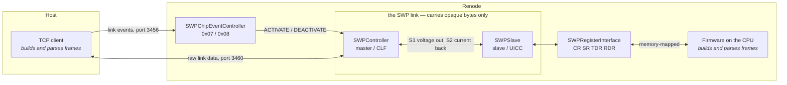
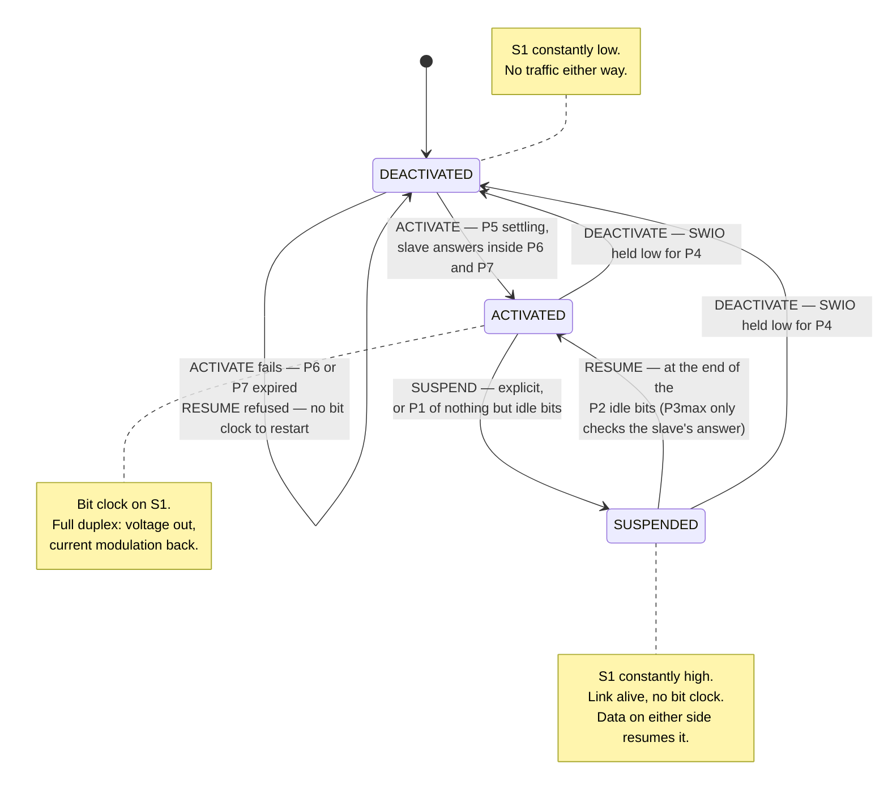
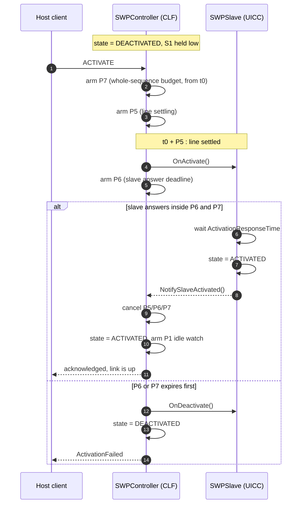
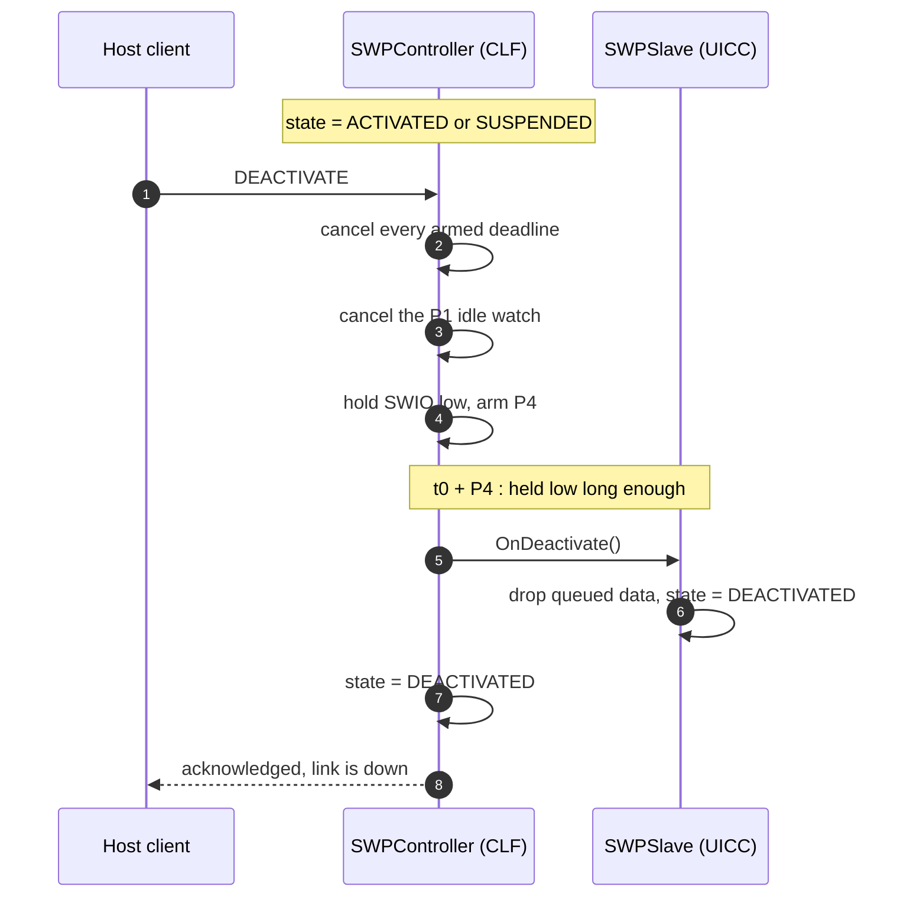
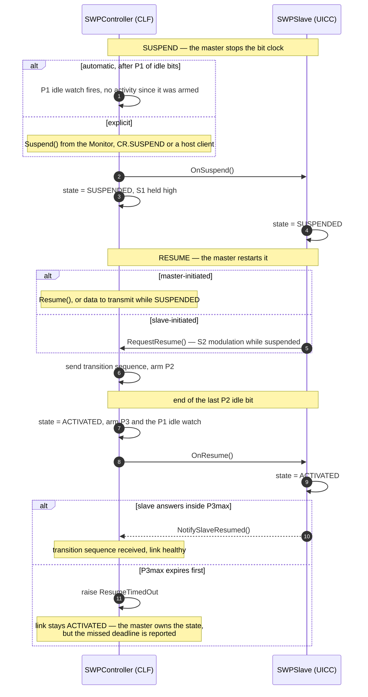
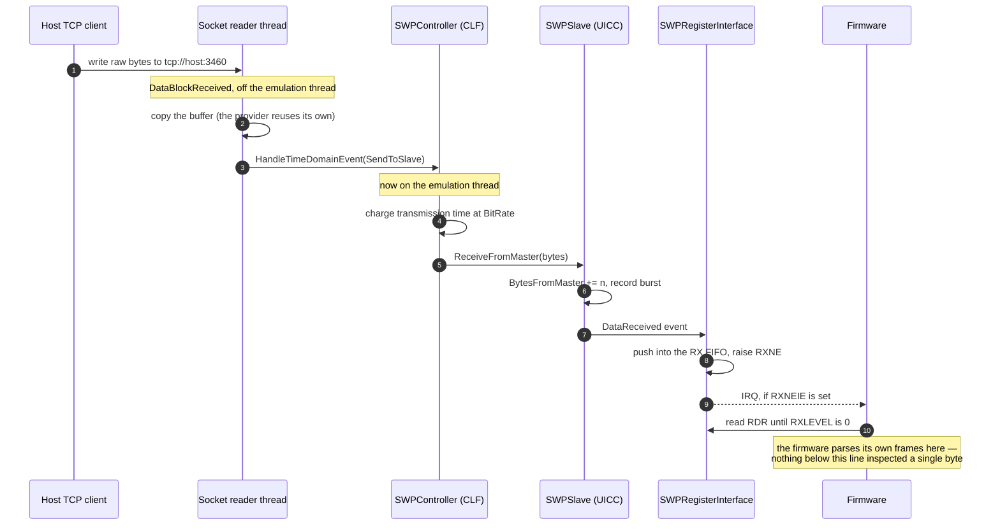
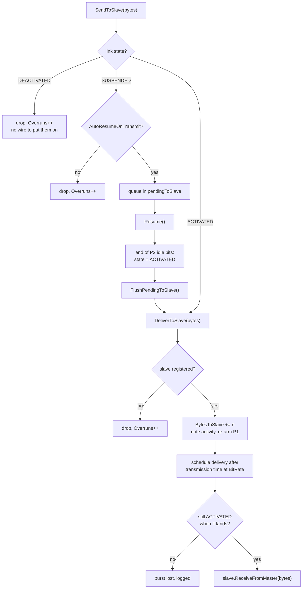
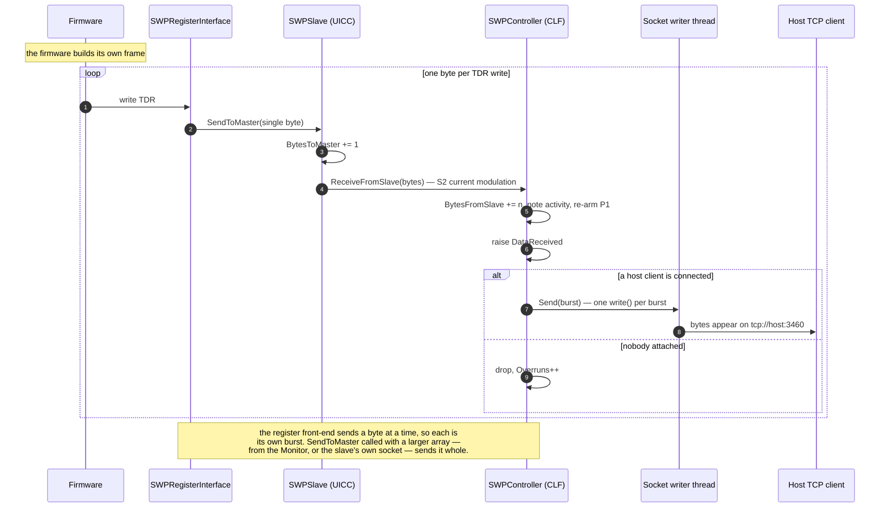
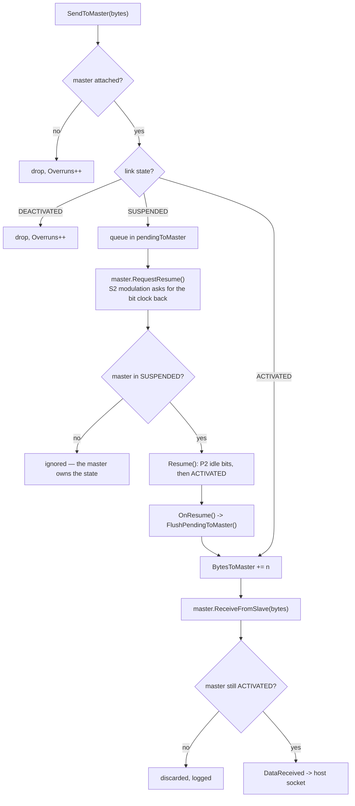

# SWP master/slave peripherals for Renode

A chip-agnostic model of the **ETSI TS 102 613 Single Wire Protocol** link for
[Renode](https://renode.io): one controller (the CLF), one slave (the UICC), a
raw TCP socket for host traffic, and the link-management timings that govern
the whole thing.

## What is and is not modelled

**Modelled** — the physical/link layer:

- the three interface states, **ACTIVATED / SUSPENDED / DEACTIVATED**
- the four transitions, **ACTIVATE / DEACTIVATE / SUSPEND / RESUME**
- the ETSI link-management timings **P1..P7**, every one of them configurable
- full-duplex raw byte transport, point-to-point, one master and one slave

**Not modelled, on purpose** — the protocol layer. No SOF/EOF, no CRC, no bit
stuffing, no HCI (TS 102 622), no gates or pipes. The peripherals carry opaque
bytes. Framing belongs to the two things at the ends of the wire: the host TCP
client at one end and the firmware at the other. Everything in `firmware/` and
`tools/java-client/` that looks like a frame is *their* framing, not the link's.

## Layout

```
peripherals/
  SWP.cs                      states, transitions, ISWPMaster/ISWPSlave,
                              SWPTimings (P1..P7), the virtual-time timer
  SWPController.cs            the master (CLF): owns the link and every
                              deadline; raw TCP socket for link data
  SWPSlave.cs                 the slave (UICC): passive on voltage, must answer
                              inside P6/P7 and P3; optional TCP socket. Designed
                              to be subclassed — see integrate.md
  SWPLoopbackSlave.cs         the smallest real subclass; a worked example and
                              the regression test for derivation
  SWPRegisterInterface.cs     memory-mapped front-end so firmware can drive
                              either end of the link
  SWPChipEventController.cs   drives the link from ChipEventController opcodes
  ChipEventController.cs      the stimulus framework this integrates with

platforms/
  swp_link.repl               a bare link: controller + slave, no CPU
  swp_chipevent.repl          the same, with event opcodes in front
  nucleo_h533re.repl          the STM32H533RE example board

scripts/                      .resc scripts for each of the above
firmware/                     bare-metal STM32H533RE demo (make)
tools/java-client/            a real Java TCP client (build.sh)
tests/                        Robot Framework suites
```

The peripherals are plain C# with no build step: the Renode Monitor compiles
them at load time via `include @peripherals/SWP.cs`. They also compile
unchanged inside the Renode source tree if you prefer that.

## Quick start

```bash
git clone --recurse-submodules https://github.com/renode/renode.git ~/renode
cd ~/renode && ./build.sh

cd /path/to/this/repo
~/renode/renode -e "path add @$PWD" -e "include @scripts/swp_link.resc"
```

Then, in the Monitor:

```
start
sysbus.swp Activate                      # DEACTIVATED -> ACTIVATED, honouring P5/P6/P7
sysbus.swp Transmit "00 A4 04 00 07"     # raw bytes towards the slave
sysbus.swp.uicc LastReceived             # what the slave got
sysbus.swp Status                        # state, timings, byte counters
```

Anything connected to `tcp://127.0.0.1:3460` gets the same data path: bytes
written there are transmitted to the slave, bytes the slave modulates back are
written out. The socket runs with Telnet mode **off**, so `0xFF` passes through
unescaped.

## The timings

Every P value is a property, read at the moment its deadline is armed — so
overriding one in a `.repl` or from the Monitor changes behaviour with no code
change:

```repl
swp: SWP.SWPController @ sysbus
    port: 3460
    P1: 20000    // idle window in ACTIVATED before the master may SUSPEND
    P2: 2000     // idle bits after the resume transition sequence
    P3: 500      // P3max: the slave must answer a RESUME inside this
    P4: 1000     // SWIO held low longer than this -> DEACTIVATED
    P5: 1000     // ACTIVATE: line settling before the slave is addressed
    P6: 10000    // ACTIVATE: the slave must answer inside this
    P7: 20000    // ACTIVATE: overall budget for the sequence
```

All values are microseconds.

**On the defaults.** The *semantics* of P1..P4 follow TS 102 613 clause 8
directly: P1 is the idle window after which the master may suspend, P2 the idle
bits that end a resume, P3max the slave's deadline to answer one, and P4 the
time SWIO must be held low to deactivate. P5..P7 cover the activation sequence,
where this model assigns the meanings documented in `SWPTimings`. The **numeric
defaults are engineering defaults, not quoted spec figures** — ETSI publishes
the normative table in clause 8, and it is paywalled. Set the properties from
your copy of the spec for a timing-exact model; nothing in the logic assumes
the shipped numbers.

## How the link behaves

Every diagram below is the shipped behaviour, not an idealisation of it: the
branches, the drops and the deadline names all correspond to code in
`peripherals/`.

### Who talks to whom



The two things that build and parse frames sit at the far ends. Everything
between them moves bytes it never looks at.

### State transitions



The master is the only side that decides the state. The slave mirrors what it
observes and has no vote — which is the wire's own arrangement, since it never
drives voltage.

### ACTIVATE

`DEACTIVATED` to `ACTIVATED`. P5, P6 and P7 are armed as **concurrent
deadlines**, not a sequence: P7 runs from t0 so an unusually long P5 cannot
hide a slave that never answers, and whichever of P6 and P7 expires first fails
the sequence.



Two shortcuts the controller takes, both logged: `Activate()` on an already
`SUSPENDED` link is treated as a `RESUME`, and `Activate()` with no slave
registered fails immediately rather than waiting out P7.

### DEACTIVATE

Any state to `DEACTIVATED`. The master holds SWIO low; only after P4 is the
link observably down and the slave told.



### SUSPEND and RESUME



Note where the state actually changes on a resume: at the **end of the last P2
idle bit**, whether or not the slave has answered yet. P3max governs the
slave's transition sequence, and missing it is reported rather than fatal —
the master owns the link state either way.

### A message travelling master to slave

The host client writes raw bytes; the firmware reads them out of `RDR`. Nothing
in between inspects a byte.



The branch logic behind that happy path:



### A message travelling slave to master

Full duplex, so this path is independent of the one above and neither waits on
the other.



And its branch logic, including the slave-initiated resume — on the wire, the
UICC modulating S2 while suspended to ask for the bit clock back:



## ChipEventController integration

`SWPChipEventController` maps the existing stimulus opcodes onto the link:

| opcode | effect |
|---|---|
| `0x07` | ACTIVATE the link |
| `0x08` | DEACTIVATE the link |

The acknowledgement is held back until the link has genuinely settled, so a
successful `0x07` means the link is up — P5 elapsed and the slave answered
inside P6/P7 — not merely that the request was accepted. If the activation
fails, the reply's interface bitmask reports SWP as down rather than lying.

One thing worth knowing if you extend this: SWP's P-delays are *concurrent*
deadlines, not a sequence. An ACTIVATE arms P5, P6 and P7 at once and whichever
expires first decides the outcome, so they must not be routed onto a serial
queue such as `DelayedSequencer` — that would run the P7 guard before the P5
step and fail every activation. The acknowledgement is instead held by a
settle-watch that re-posts itself on the sequencer while the transition is in
flight.

## The NUCLEO-H533RE example

An STM32H533RE playing the **UICC** end of the link, with a host TCP client as
the CLF. The board reaches the link through `SWPRegisterInterface`, a small
memory-mapped block at the part's SWPMI address.

> On real silicon the STM32H5's block at `0x40008800` is SWPMI, a Single Wire
> Protocol *Master* Interface. This example fronts the slave end instead, so
> the board plays the UICC. Point `slave:` at `swp` in the `.repl` and the
> roles swap, with no change to the link model. The register layout is its own
> simple thing, not a claim to be register-compatible with ST's IP.

```bash
make -C firmware                       # builds firmware/build/swp-demo.elf
./tools/java-client/build.sh

# terminal 1
~/renode/renode -e "path add @$PWD" -e "include @scripts/nucleo_h533re_swp.resc" -e start

# terminal 2
java -cp tools/java-client/out swp.Main
```

Expected output from the client:

```
Connecting: events 127.0.0.1:3456, link 127.0.0.1:3460
  ping        -> Ok
  ACTIVATE    -> link is up
  -> 7E 03 01 02 03 48 7F
  <- 02 03 04  OK
  -> 7E 02 A0 A1 76 7F
  <- A1 A2  OK
  -> 7E 05 FF 00 FF 7E 7F 1C 7F
  <- 00 01 00 7F 80  OK
  DEACTIVATE  -> link is down
ALL EXCHANGES OK
```

The third exchange is the interesting one: `FF 00 FF 7E 7F` contains `0xFF` and
bytes that look like the demo's own SOF and EOF markers, and it reaches the
firmware unchanged — because the link never inspects payload and the framing
that does is length-delimited, above it.

### Register map

`SWPRegisterInterface`, all 32-bit:

| offset | name | access | contents |
|---|---|---|---|
| `0x00` | `CR` | W | bit0 ACTIVATE, bit1 DEACTIVATE, bit2 SUSPEND, bit3 RESUME (self-clearing); bit8 `RXNEIE`, bit9 `LINKIE` |
| `0x04` | `SR` | R/W1C | bits1:0 link state (0 DEACTIVATED, 1 SUSPENDED, 2 ACTIVATED); bit2 `RXNE`; bit3 `TXE`; bit4 `LINKCH` (w1c); bit5 `OVR` (w1c) |
| `0x08` | `TDR` | W | one byte to transmit |
| `0x0C` | `RDR` | R | one received byte; pops the RX FIFO |
| `0x10` | `RXLEVEL` | R | bytes queued in the RX FIFO |

IRQ is asserted while `(RXNE && RXNEIE) || (LINKCH && LINKIE)`.

## Building your own slave

`SWPSlave` is a base class, not just a reference implementation. Everything the
controller calls is `virtual`, and the seams a derivative needs are `protected`:
`Master` to answer on, `Timer` to schedule on virtual time, `SetState` to mirror
the link, `FlushPendingToMaster` to drain what queued while it was down. The two
hooks most real parts replace are `AnswerActivation()` and `AnswerResume()` —
the points where a part runs its own handshake — plus `ReceiveFromMaster()`.

```csharp
public class AcmeSecureElement : SWPSlave
{
    public AcmeSecureElement(IMachine machine, int port = 0, bool autoStart = true)
        : base(machine, port, autoStart) { }

    protected override void AnswerActivation()
    {
        // your ACT_SYNC / ACT_POWER_MODE exchange; the base still holds you to P6/P7
        SetState(SWPState.Activated, SWPTransition.Activate);
        Master?.NotifySlaveActivated();
        FlushPendingToMaster();
    }

    public override void ReceiveFromMaster(byte[] data)
    {
        base.ReceiveFromMaster(data);
        // your stack
    }
}
```

If your class already has a base class it must keep, implement `ISWPSlave`
instead — the controller only ever talks to the interface, and `ISWPEndpoint` is
wide enough that `SWPRegisterInterface` still works either way, so you keep the
memory-mapped block for your firmware.

One trap worth knowing before you start: the controller holds the slave as an
`ISWPSlave` and calls through the interface, so a `new` method instead of an
`override` compiles, reads correctly, and never runs. **[integrate.md](integrate.md)**
covers this and the rest of the process in full.

## Tests

```bash
RENODE_ROOT=~/renode ./run-tests.sh
```

Two suites, 35 cases, all passing:

- `tests/swp.robot` (28) — every state, every transition, each timing boundary
  (P5 before the slave is addressed, P6/P7 activation failure, the end of the
  P2 idle bits, P3max, P4 before deactivation takes effect), the full-duplex
  byte path, payload transparency, and runtime reconfiguration of the timings.
- `tests/nucleo_h533re_swp.robot` (7) — the example end to end: firmware boot,
  link state visible through the register block, a framed request answered, and
  the ChipEventController opcodes.

Three of those cases exist specifically to protect derivation: an override is
actually called through the controller, the base class does *not* do the same
thing on its own, and a slave reached only through `ISWPSlave` still drives the
register block.

Every timing assertion advances virtual time with `emulation RunFor`, never a
host sleep, so the suite is deterministic and replayable.

## Reference

`docs/swp-protocol-reference.md` is a protocol-level primer on SWP: the
single-wire full-duplex trick, the C6 contact, framing, the HCI layer above,
and a debugging checklist.
